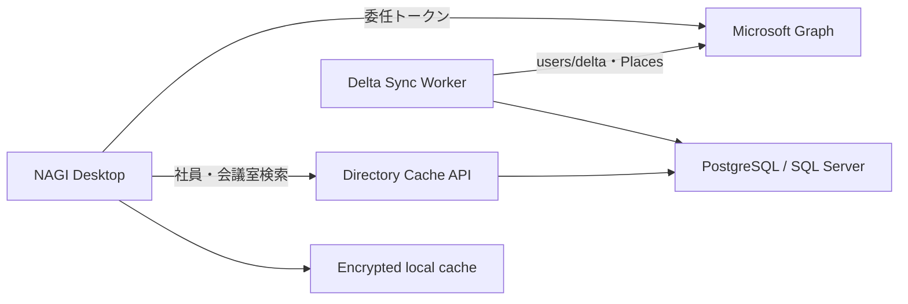

# Outlook Calendar代替デスクトップアプリ提案

## 1. プロダクトの定義

このアプリは単なる「軽いOutlook」ではなく、**誰と、どの会議室で、いつ会えるかを最短で決めるスケジュール・コックピット**として設計します。

仮称は **NAGI**。予定の密度が高くても、判断は静かにできることを目指します。

最重要の体験は次の3つです。

1. 3万件の社員名簿から、名前・所属・よみ・メールを横断して即時検索する
2. 保存した人・チーム・会議室の組み合わせを一瞬で切り替える
3. 共通の空き時間を候補として提示し、その場で会議を作成する

## 2. 元の要望に加える提案

### チームと「表示セット」を分ける

- **チーム**：人の集合。例「プロダクト開発」
- **表示セット**：人、会議室、表示粒度を保存した組み合わせ。例「プロダクト開発 + HIKARI 12F + 週表示」

同じチームでも、用途ごとに会議室や表示方法を変えられます。

### 空き時間レンズ

選択中の人と会議室の共通空き枠を、画面上部に順位付きで表示します。候補を押すと時間を選択した状態で作成ドロワーが開きます。高速検索に加えて、「空いている時間を探す作業」自体を減らします。

### 人数に応じて表示を変える

- 1〜5人：個別予定を通常表示
- 6人以上：予定の重なりを空き状況ヒートマップへ自動圧縮
- 月表示：詳細の羅列ではなく、会議密度・競合・空き時間量を集約
- 日表示：人と会議室を横レーンで比較

### 招待対象は明示的に決める

表示中のメンバーを自動で全員招待しません。「表示中のメンバーを参加者に追加」を明示操作にし、誤送信を防ぎます。

### 背景は可読性を壊さない

UI全体の透明度を1本のスライダーで変えず、背景の明るさ／見え方とパネル透過を分離します。「クリア」「ミスト」「集中」の3プリセットと自動可読性補正を用意します。

## 3. データ設計の重要判断

### 事前取得するもの

- 社員名簿：氏名、メール、所属、役職、勤務地、在籍状態など
- 会議室カタログ：拠点、階、定員、設備、メールアドレスなど
- ユーザーが保存したチーム／表示セット

### 全件事前取得しないもの

**3万人分の予定詳細は保存しません。** 表示中のユーザー、会議室、期間だけをGraphから取得し、短時間キャッシュします。

全社予定表の永続キャッシュは、同期量、権限、機密性、退職・異動時のデータ管理を大きく悪化させます。高速化すべき第一対象は社員検索であり、予定は表示範囲の前後を先読みするのが安全です。

更新日時も分けて表示します。

- 社員名簿：最終更新、件数、追加／変更／無効件数
- 予定表：表示範囲を最後に取得した時刻

## 4. 推奨アーキテクチャ

### PoC / 小規模導入

- Windowsデスクトップ：.NET 8 + WinUI 3
- UI：React + TypeScriptをWebView2で表示、またはWinUI 3ネイティブ
- 認証：MSAL.NET + Windows Web Account Manager（WAM）
- ローカルDB：SQLite + FTS5
- 予定表：Microsoft Graphをユーザー本人の委任権限で呼び出す
- 配布：MSIX

高度なカレンダー描画と背景表現はWeb UIが作りやすく、認証・OS統合は.NET側で扱う構成が現実的です。デスクトップアプリはpublic clientのため、client secretやapp-only証明書を埋め込みません。[Public client / confidential client](https://learn.microsoft.com/en-us/entra/identity-platform/msal-client-applications)、[WAM](https://learn.microsoft.com/en-us/entra/msal/dotnet/acquiring-tokens/desktop-mobile/wam)

### 複数部門へ本番展開する段階

社員名簿と会議室カタログは、各端末が個別同期する方式から共有キャッシュAPIへ移します。

共有キャッシュに置くのはディレクトリと会議室メタデータだけです。予定表は原則としてデスクトップから本人権限で取得します。全社予定表のapp-onlyアクセスが不可避な場合はデスクトップではなくサーバーに置き、Exchange Online Application RBACで対象メールボックスを限定します。[Exchange Application RBAC](https://learn.microsoft.com/en-us/exchange/permissions-exo/application-rbac)

## 5. Microsoft Graphの使い分け

| 用途 | API | 方針 |
|---|---|---|
| 社員名簿 | `GET /users/delta` | 初回全件、以後差分。Graph `id`を主キーにする |
| 複数人・会議室の空き状況 | `POST /me/calendar/getSchedule` | 20エンティティずつ分割、62日未満 |
| 日・週・月の予定詳細 | `calendarView` | 選択した期間だけ取得 |
| 選択済み予定表の再取得 | `calendarView/delta` | カレンダーと期間ごとにtokenを管理 |
| 会議室一覧 | Places API | 拠点・階・定員・設備をキャッシュ |
| 会議作成 | `POST /me/calendar/events` | 部屋を`resource`参加者として追加 |

ユーザーdeltaは`@odata.nextLink`を最後まで追い、最後の`@odata.deltaLink`を保存します。delta tokenが失効した場合はフル同期に戻します。[users delta](https://learn.microsoft.com/en-us/graph/api/user-delta?view=graph-rest-1.0)、[delta query概要](https://learn.microsoft.com/en-us/graph/delta-query-overview)

所属検索に使う`department`は基本プロフィール権限だけでは不足するため、現実的には管理者同意済みの`User.Read.All`が必要です。[Microsoft Graph permissions reference](https://learn.microsoft.com/en-us/graph/permissions-reference#userreadall)

空き状況には[getSchedule](https://learn.microsoft.com/en-us/graph/api/calendar-getschedule?view=graph-rest-1.0)、予定詳細には[calendarView](https://learn.microsoft.com/en-us/graph/api/calendar-list-calendarview?view=graph-rest-1.0)を使い分けます。他ユーザーの予定は共有権限によって詳細が見えないため、UIは必ず「予定あり」と詳細予定を分けます。[予定表の共有と委任](https://learn.microsoft.com/en-us/graph/outlook-share-or-delegate-calendar)

会議室は非推奨の`findRooms`ではなく[Places API](https://learn.microsoft.com/en-us/graph/api/resources/places-api-overview?view=graph-rest-1.0)を使います。予約時は部屋のSMTPアドレスを`resource`参加者として追加し、Exchange側からの承認／拒否状態を表示します。

予定作成は委任`Calendars.ReadWrite`で本人の予定表に行い、再試行時の二重登録を防ぐため`transactionId`を付けます。[イベント作成](https://learn.microsoft.com/en-us/graph/api/calendar-post-events?view=graph-rest-1.0)

## 6. ローカル検索

30,000件はSQLiteで十分に高速です。FTS5の検索対象は次の通りです。

- 表示名、姓、名
- ひらがな／カタカナ／ローマ字読み
- メール、社員番号
- 所属階層、役職、勤務地

入力をNFKC正規化し、全半角・大文字小文字・かな表記を吸収します。「開発 佐藤 東京」のような複数語をAND検索し、完全一致、前方一致、読み一致、所属一致の順に順位付けします。目標応答は150ms以内です。

同期はステージングテーブルへ取り込み、検証後に切り替えます。失敗時は最後に成功したスナップショットを維持します。

## 7. 最小権限とプライバシー

- サインイン：`openid`, `profile`, `offline_access`
- 社員・所属：`User.Read.All`（管理者同意）
- 会議室：`Place.Read.All`（管理者同意）
- 自分の予定表示／作成：`Calendars.ReadWrite`
- 共有予定表：共有設定と必要時のみ`Calendars.Read.Shared`等

件名や場所が見えない予定は「予定あり」と表示します。本文、参加者、会議リンクを不要にローカル永続化しません。キャッシュはOS資格情報と連携して暗号化し、サインアウト時に破棄できるようにします。

## 8. 優先順位

### MVP

- Microsoft 365サインイン
- 社員名簿の初回取得／手動更新／更新日時
- 名前・よみ・メール・所属検索
- 静的チームと表示セット
- 日・週・月表示
- free/busyと権限に応じた予定詳細
- 会議室検索と空き時間レンズ
- 会議作成、Teams会議、会議室予約
- 背景画像、可読性プリセット

### 次の段階

- 日次delta同期 + 手動更新
- スマートチーム（所属条件で自動更新）
- 仮押さえ、下書き、Undo
- 1on1、面接、定例などの予定テンプレート
- 勤務時間、休暇、タイムゾーンを考慮した候補
- オフライン閲覧
- 自然文入力

## 9. 先に検証するユーザーテスト

初見のユーザーに次の3タスクを依頼します。

1. 部署と氏名から3人を登録する
2. 3人と会議室が空く60分を探して予約する
3. 別の表示セットへ切り替える

目標は会議予約まで60秒以内。検索時間だけでなく、クリック数、迷った箇所、詳細を開いた回数、誤招待の有無を計測します。
